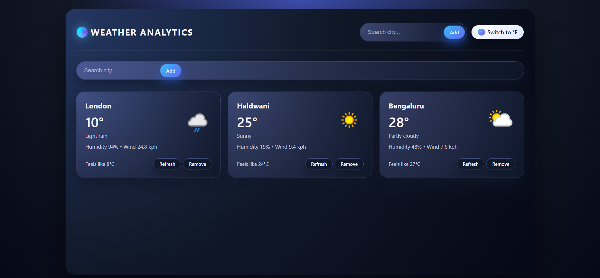
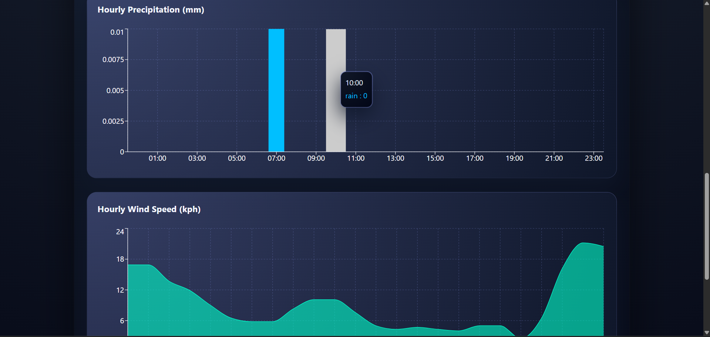

<h1 align="center">🌦️ Weather Analytics Dashboard</h1>

<p align="center"> A modern frontend web application that provides real-time weather insights, detailed forecasts,
  and interactive analytics for multiple cities through a clean, responsive, and data-driven dashboard. </p> 
<p align="center">  </p>


📌 Project Overview
---
The Weather Analytics Dashboard is a frontend-focused application built to demonstrate advanced React architecture, centralized state management, API integration, caching strategies, and interactive data visualization.
The application allows users to:
- View real-time weather data
- Explore hourly and 5–7 day forecasts
- Analyze temperature and precipitation trends
- Search and favorite cities
- Switch between Celsius and Fahrenheit
---

🚀 Key Features

- 🌦️ Real-time weather updates (≤ 60 seconds old)
- 🏙️ Dashboard with multiple city weather cards
- 🔍 API-based city search with autocomplete
- ⭐ Favorite cities (persisted between sessions)
- 📊 Interactive charts (temperature, precipitation, wind)
- 📅 Hourly & 5–7 day forecasts
- 🌡️ Celsius ↔ Fahrenheit toggle
- 💾 Local caching to reduce API calls
- 📱 Fully responsive design
-⚡ Optimized state management with Redux Toolkit
---

<h1 align="center">Analytic Page</h1>

<p align="center">  </p>

<p align="center">  </p>


## ⚒️ Tech Stack

### Frontend
- React.js (Vite)
- Recharts (for data visualization)
- JavaScript (ES6+)
- React Router DOM
- Redux-Toolkit
- CSS


---

## 🧪 Environment Setup


### 📂 Frontend (`/frontend/.env`)

Create a `.env` file inside the frontend folder:

```env
VITE_WEATHER_API_KEY=YOUR_wEATHER_KEY
```

---

## 🔧 Run the Frontend

```bash
cd frontend
npm install
npm run dev
```


---
